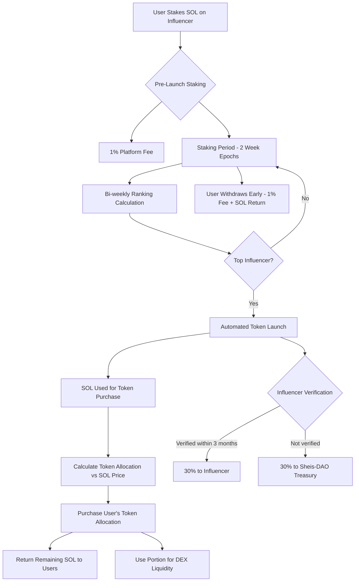

# Kapikol SocialFi Protocol - Smart Contract Architecture v2.0

## Table of Contents
1. [Executive Summary](#executive-summary)
2. [Core Protocol Overview](#core-protocol-overview)
3. [Smart Contract Architecture](#smart-contract-architecture)
4. [Staking & Unstaking Mechanisms](#staking--unstaking-mechanisms)
5. [Token Launch & Distribution](#token-launch--distribution)
6. [Security Framework](#security-framework)
7. [Governance & Emergency Controls](#governance--emergency-controls)
8. [Technical Implementation](#technical-implementation)
9. [Economic Model](#economic-model)
10. [Risk Assessment & Mitigation](#risk-assessment--mitigation)

---

## Executive Summary

The Kapikol SocialFi Protocol is a Solana-based decentralized platform enabling community-driven token purchases for social media influencers with automated token launches for top-ranked creators. This architecture implements a sophisticated multi-signature security model, emergency governance controls, and sustainable tokenomics designed for long-term ecosystem growth.

### Key Features
- **Direct Token Purchase**: SOL stakes are used to purchase token allocations at launch
- **Automated Rankings**: On-chain ranking system with 2-week epoch cycles
- **SOL Return System**: Remaining SOL after token purchase returned to users
- **Dynamic Liquidity Provision**: Portion of remaining SOL used for DEX liquidity
- **Multi-Signature Security**: Triple-layer security with platform, treasury, and developer controls
- **Emergency Governance**: Content moderation and forced refund capabilities
- **Community Fund Integration**: Unclaimed allocations benefit women creators through Sheis-DAO

---

## Core Protocol Overview

### Protocol Flow



### Epoch System
- **Duration**: 2 weeks (336 hours)
- **Ranking Calculation**: Automated at epoch end
- **Token Launch**: Only top-ranked influencer per epoch
- **Continuous Competition**: All stakers compete across epochs until withdrawal or launch

---

## Smart Contract Architecture

### Program Structure (Anchor Framework)

#### 1. Master Protocol Program
```rust
// Core protocol state and epoch management
pub struct GlobalProtocolState {
    pub version: u8,
    pub authority: Pubkey,              // Platform multisig
    pub current_epoch: u64,
    pub epoch_start_time: i64,
    pub total_influencers: u32,
    pub total_staked_sol: u64,
    pub platform_treasury: Pubkey,
    pub emergency_mode: bool,           // Emergency shutdown flag
    pub paused: bool,                   // Operational pause flag
}
```

#### 2. Staking Management Program
```rust
// Individual influencer vault
pub struct InfluencerVault {
    pub influencer_id: [u8; 32],       // Unique identifier
    pub social_handle: String,          // Instagram/social handle
    pub verification_status: VerificationStatus,
    pub total_staked: u64,
    pub unique_stakers: u32,
    pub creation_epoch: u64,
    pub last_activity: i64,
    pub content_flag: ContentFlag,      // Moderation status
    pub launch_status: LaunchStatus,
}

// Individual stake position for token purchase
pub struct StakePosition {
    pub staker: Pubkey,
    pub influencer_vault: Pubkey,
    pub gross_amount: u64,              // Original staked amount
    pub net_amount: u64,                // Amount after fees
    pub stake_timestamp: i64,
    pub epoch_staked: u64,
    pub position_status: PositionStatus,
    pub token_allocation: u64,          // Tokens to be purchased at launch
    pub sol_for_purchase: u64,          // SOL reserved for token purchase
    pub sol_for_liquidity: u64,         // SOL portion for liquidity provision
    pub remaining_sol: u64,             // SOL to be returned to user
}
```

#### 3. Token Launch Program
```rust
// Token launch configuration
pub struct TokenLaunchConfig {
    pub influencer_vault: Pubkey,
    pub token_mint: Pubkey,
    pub total_supply: u64,              // Fixed at 1,000,000,000 tokens
    pub launch_timestamp: i64,
    pub verification_deadline: i64,     // 3 months from launch
    pub distribution_complete: bool,
    pub initial_token_price: u64,       // Token price in SOL (with decimals)
    pub total_sol_for_purchases: u64,   // Total SOL used for token purchases
    pub total_sol_for_liquidity: u64,   // Total SOL used for liquidity
    pub total_sol_returned: u64,        // Total SOL returned to users
}

// Token allocation for direct purchase (no vesting needed)
pub struct TokenAllocation {
    pub beneficiary: Pubkey,
    pub purchased_tokens: u64,          // Tokens purchased directly with SOL
    pub purchase_price_per_token: u64,  // Price paid per token
    pub purchase_timestamp: i64,        // When tokens were purchased
    pub claimed: bool,                  // Whether tokens have been claimed
}

// Linear vesting utility structure
pub struct LinearVesting {
    pub total_amount: u64,
    pub start_time: i64,
    pub duration: i64,                  // Vesting duration in seconds
    pub cliff_time: i64,                // Optional cliff period
}
```

#### 4. Treasury Management Program
```rust
// Platform treasury account
pub struct PlatformTreasury {
    pub authority: Pubkey,              // 3-of-5 multisig
    pub total_fees_collected: u64,
    pub staking_fees: u64,              // 1% pre-launch
    pub unstaking_fees: u64,            // 1% pre-launch, 2% post-launch
    pub operational_expenses: u64,
    pub revenue_sharing: u64,           // To Sheis-DAO
}

// Sheis-DAO community treasury
pub struct SheisDAOTreasury {
    pub authority: Pubkey,              // Sheis-DAO multisig
    pub unclaimed_tokens: u64,          // From unverified influencers (30%)
    pub platform_revenue_share: u64,   // Revenue sharing from platform
    pub grants_distributed: u64,
    pub active_programs: u32,
}

// Developer vesting account
pub struct DeveloperVesting {
    pub authority: Pubkey,              // Capital/Developer account
    pub total_allocation: u64,          // 10% of tokens from each launch
    pub vesting_schedule: LinearVesting, // Linear vesting over time
    pub claimed_amount: u64,
    pub last_claim_time: i64,
}
```

### Enumerations & Status Types

```rust
#[derive(AnchorSerialize, AnchorDeserialize, Clone, PartialEq)]
pub enum VerificationStatus {
    Unverified,
    Pending,
    Verified,
    Rejected,
    Expired,
}

#[derive(AnchorSerialize, AnchorDeserialize, Clone, PartialEq)]
pub enum PositionStatus {
    Active,              // Normal staking state
    PreLaunchWithdraw,   // Withdrew before launch (SOL returned)
    TokensPurchased,     // Tokens purchased at launch
    TokensClaimed,       // Tokens claimed by user
    Completed,           // Fully settled
}

#[derive(AnchorSerialize, AnchorDeserialize, Clone, PartialEq)]
pub enum ContentFlag {
    Clean,               // No issues
    UnderReview,         // Manual review in progress
    Flagged,             // Content violation detected
    Banned,              // Permanently banned
}

#[derive(AnchorSerialize, AnchorDeserialize, Clone, PartialEq)]
pub enum LaunchStatus {
    Competing,           // In ranking competition
    Launching,           // Token launch in progress
    Launched,            // Token successfully launched
    Failed,              // Launch failed or cancelled
}
```

---

## Staking & Token Purchase Mechanisms

### Pre-Launch Staking for Token Allocation
```rust
pub fn stake_on_influencer(
    ctx: Context<StakeOnInfluencer>,
    amount: u64,
) -> Result<()> {
    require!(!ctx.accounts.global_state.paused, ErrorCode::ProtocolPaused);
    require!(amount >= MIN_STAKE_AMOUNT, ErrorCode::InsufficientStakeAmount);
    
    // Calculate 1% platform fee
    let platform_fee = amount
        .checked_mul(100)
        .unwrap()
        .checked_div(10000)
        .unwrap();
    
    let net_stake = amount.checked_sub(platform_fee).unwrap();
    
    // Transfer fee to platform treasury
    transfer_to_platform_treasury(ctx, platform_fee)?;
    
    // Create or update stake position for token purchase
    let stake_position = &mut ctx.accounts.stake_position;
    stake_position.staker = ctx.accounts.staker.key();
    stake_position.gross_amount = amount;
    stake_position.net_amount = net_stake;
    stake_position.stake_timestamp = Clock::get()?.unix_timestamp;
    stake_position.epoch_staked = ctx.accounts.global_state.current_epoch;
    stake_position.position_status = PositionStatus::Active;
    
    // Reserve SOL for future token purchase (proportional allocation)
    stake_position.sol_for_purchase = net_stake; // Will be recalculated at launch based on token price
    stake_position.sol_for_liquidity = 0; // Calculated at launch
    stake_position.remaining_sol = 0; // Calculated at launch
    
    // Update influencer vault
    let influencer_vault = &mut ctx.accounts.influencer_vault;
    influencer_vault.total_staked = influencer_vault.total_staked
        .checked_add(net_stake)
        .unwrap();
    
    // Update global state
    let global_state = &mut ctx.accounts.global_state;
    global_state.total_staked_sol = global_state.total_staked_sol
        .checked_add(net_stake)
        .unwrap();
    
    emit!(StakingEvent {
        staker: ctx.accounts.staker.key(),
        influencer: ctx.accounts.influencer_vault.key(),
        amount: net_stake,
        fee: platform_fee,
        epoch: ctx.accounts.global_state.current_epoch,
    });
    
    Ok(())
}
```

### Pre-Launch Withdrawal (1% Fee + Full SOL Return)
```rust
pub fn withdraw_pre_launch(
    ctx: Context<WithdrawPreLaunch>,
) -> Result<()> {
    require!(!ctx.accounts.global_state.emergency_mode, ErrorCode::EmergencyModeActive);
    require!(
        ctx.accounts.influencer_vault.launch_status == LaunchStatus::Competing,
        ErrorCode::InvalidWithdrawState
    );
    
    let stake_position = &mut ctx.accounts.stake_position;
    require!(
        stake_position.position_status == PositionStatus::Active,
        ErrorCode::InvalidPositionStatus
    );
    
    // Calculate 1% withdrawal fee
    let withdrawal_fee = stake_position.net_amount
        .checked_mul(100)
        .unwrap()
        .checked_div(10000)
        .unwrap();
    
    let return_amount = stake_position.net_amount
        .checked_sub(withdrawal_fee)
        .unwrap();
    
    // Transfer fee to platform treasury
    transfer_to_platform_treasury(ctx, withdrawal_fee)?;
    
    // Return SOL to staker's original wallet
    transfer_sol_to_staker(ctx, return_amount)?;
    
    // Update position status
    stake_position.position_status = PositionStatus::PreLaunchWithdraw;
    
    // Update influencer vault
    let influencer_vault = &mut ctx.accounts.influencer_vault;
    influencer_vault.total_staked = influencer_vault.total_staked
        .checked_sub(stake_position.net_amount)
        .unwrap();
    
    emit!(WithdrawEvent {
        staker: ctx.accounts.staker.key(),
        amount_returned: return_amount,
        fee: withdrawal_fee,
        withdraw_type: WithdrawType::PreLaunch,
    });
    
    Ok(())
}
```

### Post-Launch Token Claiming (No Additional Fees)
```rust
pub fn claim_purchased_tokens(
    ctx: Context<ClaimPurchasedTokens>,
) -> Result<()> {
    require!(!ctx.accounts.global_state.emergency_mode, ErrorCode::EmergencyModeActive);
    
    let token_allocation = &mut ctx.accounts.token_allocation;
    require!(
        !token_allocation.claimed,
        ErrorCode::TokensAlreadyClaimed
    );
    
    let stake_position = &ctx.accounts.stake_position;
    require!(
        stake_position.position_status == PositionStatus::TokensPurchased,
        ErrorCode::TokensNotPurchasedYet
    );
    
    // Transfer purchased tokens to user (no additional fees)
    transfer_tokens_to_user(ctx, token_allocation.purchased_tokens)?;
    
    // Return any remaining SOL that wasn't used for purchase or liquidity
    if stake_position.remaining_sol > 0 {
        transfer_sol_to_staker(ctx, stake_position.remaining_sol)?;
    }
    
    // Update allocation status
    token_allocation.claimed = true;
    
    // Update position status
    let stake_position = &mut ctx.accounts.stake_position;
    stake_position.position_status = PositionStatus::TokensClaimed;
    
    emit!(TokenClaimEvent {
        staker: ctx.accounts.staker.key(),
        tokens_received: token_allocation.purchased_tokens,
        sol_returned: stake_position.remaining_sol,
        claim_timestamp: Clock::get()?.unix_timestamp,
    });
    
    Ok(())
}
```

---

## Token Launch & Distribution

### Automated Token Launch & Purchase Process
```rust
pub fn execute_token_launch(
    ctx: Context<ExecuteTokenLaunch>,
    initial_token_price: u64, // Price per token in SOL (with decimals)
) -> Result<()> {
    let global_state = &mut ctx.accounts.global_state;
    let influencer_vault = &mut ctx.accounts.influencer_vault;
    
    // Verify this influencer won the current epoch
    require!(
        is_top_ranked_influencer(influencer_vault.key())?,
        ErrorCode::NotTopRanked
    );
    
    require!(
        influencer_vault.launch_status == LaunchStatus::Competing,
        ErrorCode::AlreadyLaunched
    );
    
    // Create token mint
    let token_mint = create_token_mint(ctx, TOTAL_TOKEN_SUPPLY)?;
    
    // Initialize token launch config
    let launch_config = &mut ctx.accounts.launch_config;
    launch_config.influencer_vault = influencer_vault.key();
    launch_config.token_mint = token_mint;
    launch_config.total_supply = TOTAL_TOKEN_SUPPLY;
    launch_config.launch_timestamp = Clock::get()?.unix_timestamp;
    launch_config.verification_deadline = Clock::get()?.unix_timestamp + (90 * 24 * 60 * 60); // 3 months
    launch_config.initial_token_price = initial_token_price;
    
    // Update influencer vault status
    influencer_vault.launch_status = LaunchStatus::Launched;
    
    // Process token purchases for all stakers
    process_staker_token_purchases(ctx, initial_token_price)?;
    
    // Distribute token allocations
    hold_tokens_for_influencer(ctx)?;        // 30% pending verification
    vest_tokens_to_developers(ctx)?;         // 10% to developers (linear vesting)
    
    // Use remaining SOL for liquidity provision (calculated from all purchases)
    provide_liquidity_with_remaining_sol(ctx)?; // Dynamic amount based on purchase calculations
    
    // Start new epoch
    global_state.current_epoch = global_state.current_epoch.checked_add(1).unwrap();
    global_state.epoch_start_time = Clock::get()?.unix_timestamp;
    
    emit!(TokenLaunchEvent {
        influencer: influencer_vault.key(),
        token_mint: token_mint,
        epoch: global_state.current_epoch.checked_sub(1).unwrap(),
        launch_time: launch_config.launch_timestamp,
        token_price: initial_token_price,
    });
    
    Ok(())
}
```

### Influencer Verification & Claim (3-Month Window)
```rust
pub fn influencer_claim_allocation(
    ctx: Context<InfluencerClaim>,
    verification_proof: Vec<u8>,
) -> Result<()> {
    let launch_config = &ctx.accounts.launch_config;
    require!(
        Clock::get()?.unix_timestamp <= launch_config.verification_deadline,
        ErrorCode::VerificationPeriodExpired
    );
    
    // Verify social media proof (integrate with oracle)
    verify_social_media_ownership(ctx, verification_proof)?;
    
    let influencer_allocation = TOTAL_TOKEN_SUPPLY
        .checked_mul(30)
        .unwrap()
        .checked_div(100)
        .unwrap();
    
    // Transfer tokens to verified influencer
    transfer_tokens_to_influencer(ctx, influencer_allocation)?;
    
    emit!(InfluencerClaimEvent {
        influencer: ctx.accounts.influencer_vault.key(),
        amount: influencer_allocation,
        claim_time: Clock::get()?.unix_timestamp,
    });
    
    Ok(())
}

pub fn process_expired_verification(
    ctx: Context<ProcessExpiredVerification>,
) -> Result<()> {
    let launch_config = &ctx.accounts.launch_config;
    require!(
        Clock::get()?.unix_timestamp > launch_config.verification_deadline,
        ErrorCode::VerificationNotExpired
    );
    
    let unclaimed_allocation = TOTAL_TOKEN_SUPPLY
        .checked_mul(30)
        .unwrap()
        .checked_div(100)
        .unwrap();
    
    // Transfer unclaimed tokens to Sheis-DAO treasury or redistribute to stakers
    transfer_unclaimed_tokens_to_treasury_or_stakers(ctx, unclaimed_allocation)?;
    
    emit!(UnclaimedAllocationEvent {
        influencer: ctx.accounts.influencer_vault.key(),
        amount: unclaimed_allocation,
        transferred_to: ctx.accounts.sheisdao_treasury.key(),
    });
    
    Ok(())
}

/// Process token purchases for all stakers based on their SOL stakes
pub fn process_staker_token_purchases(
    ctx: Context<ProcessTokenPurchases>,
    token_price: u64,
) -> Result<()> {
    let launch_config = &mut ctx.accounts.launch_config;
    let influencer_vault = &ctx.accounts.influencer_vault;
    
    let staker_allocation_percentage = 60; // 60% of tokens available for purchase
    let total_tokens_for_purchase = TOTAL_TOKEN_SUPPLY
        .checked_mul(staker_allocation_percentage)
        .unwrap()
        .checked_div(100)
        .unwrap();
    
    let mut total_sol_used_for_purchases = 0u64;
    let mut total_sol_for_liquidity = 0u64;
    let mut total_sol_returned = 0u64;
    
    // Iterate through all stake positions for this influencer
    for stake_account in ctx.remaining_accounts.iter() {
        let mut stake_position = StakePosition::try_deserialize(&mut stake_account.data.borrow_mut().as_ref())?;
        
        if stake_position.position_status == PositionStatus::Active {
            // Calculate proportional token allocation
            let stake_percentage = stake_position.net_amount
                .checked_mul(10000)
                .unwrap()
                .checked_div(influencer_vault.total_staked)
                .unwrap();
                
            let token_allocation = total_tokens_for_purchase
                .checked_mul(stake_percentage as u64)
                .unwrap()
                .checked_div(10000)
                .unwrap();
            
            // Calculate SOL needed to purchase allocated tokens
            let sol_needed_for_tokens = token_allocation
                .checked_mul(token_price)
                .unwrap()
                .checked_div(1_000_000_000) // Adjust for token decimals
                .unwrap();
            
            let sol_for_purchase = std::cmp::min(sol_needed_for_tokens, stake_position.net_amount);
            let actual_tokens_purchased = sol_for_purchase
                .checked_mul(1_000_000_000)
                .unwrap()
                .checked_div(token_price)
                .unwrap();
            
            // Calculate remaining SOL distribution
            let remaining_sol = stake_position.net_amount.checked_sub(sol_for_purchase).unwrap();
            let sol_for_liquidity_portion = remaining_sol.checked_mul(30).unwrap().checked_div(100).unwrap(); // 30% for liquidity
            let sol_to_return = remaining_sol.checked_sub(sol_for_liquidity_portion).unwrap(); // Rest returned to user
            
            // Update stake position
            stake_position.token_allocation = actual_tokens_purchased;
            stake_position.sol_for_purchase = sol_for_purchase;
            stake_position.sol_for_liquidity = sol_for_liquidity_portion;
            stake_position.remaining_sol = sol_to_return;
            stake_position.position_status = PositionStatus::TokensPurchased;
            
            // Update totals
            total_sol_used_for_purchases = total_sol_used_for_purchases.checked_add(sol_for_purchase).unwrap();
            total_sol_for_liquidity = total_sol_for_liquidity.checked_add(sol_for_liquidity_portion).unwrap();
            total_sol_returned = total_sol_returned.checked_add(sol_to_return).unwrap();
            
            // Create token allocation record
            create_token_allocation_record(ctx, &stake_position, actual_tokens_purchased, token_price)?;
        }
    }
    
    // Update launch config with totals
    launch_config.total_sol_for_purchases = total_sol_used_for_purchases;
    launch_config.total_sol_for_liquidity = total_sol_for_liquidity;
    launch_config.total_sol_returned = total_sol_returned;
    
    emit!(TokenPurchaseProcessedEvent {
        influencer: influencer_vault.key(),
        total_sol_for_purchases: total_sol_used_for_purchases,
        total_sol_for_liquidity: total_sol_for_liquidity,
        total_sol_returned: total_sol_returned,
        token_price: token_price,
    });
    
    Ok(())
}

/// Vests 10% of tokens to developers with linear vesting
pub fn vest_tokens_to_developers(
    ctx: Context<VestTokensToDevelopers>,
) -> Result<()> {
    let developer_allocation = TOTAL_TOKEN_SUPPLY
        .checked_mul(10)
        .unwrap()
        .checked_div(100)
        .unwrap();
    
    let developer_vesting = &mut ctx.accounts.developer_vesting;
    developer_vesting.total_allocation = developer_allocation;
    developer_vesting.vesting_schedule = LinearVesting::new(
        developer_allocation,
        Clock::get()?.unix_timestamp,
        3 * 365 * 24 * 60 * 60, // 3 years in seconds
    );
    
    emit!(DeveloperVestingEvent {
        amount: developer_allocation,
        start_time: Clock::get()?.unix_timestamp,
        vesting_duration: 3 * 365 * 24 * 60 * 60,
    });
    
    Ok(())
}

/// Handles redistribution of unclaimed tokens (30%) to she.is.treasury or stakers
pub fn transfer_unclaimed_tokens_to_treasury_or_stakers(
    ctx: Context<TransferUnclaimedTokens>,
    unclaimed_allocation: u64,
) -> Result<()> {
    // First attempt to transfer to she.is.treasury
    match transfer_tokens_to_sheisdao_treasury(ctx, unclaimed_allocation) {
        Ok(_) => {
            emit!(UnclaimedAllocationEvent {
                influencer: ctx.accounts.influencer_vault.key(),
                amount: unclaimed_allocation,
                transferred_to: ctx.accounts.sheisdao_treasury.key(),
                allocation_type: "SheisDAO Treasury".to_string(),
            });
        },
        Err(_) => {
            // If she.is.treasury doesn't claim, redistribute to stakers
            redistribute_to_existing_stakers(ctx, unclaimed_allocation)?;
            
            emit!(UnclaimedAllocationEvent {
                influencer: ctx.accounts.influencer_vault.key(),
                amount: unclaimed_allocation,
                transferred_to: Pubkey::default(), // Distributed among stakers
                allocation_type: "Redistributed to Stakers".to_string(),
            });
        }
    }
    
    Ok(())
}
```

---

## Security Framework

### Multi-Signature Architecture

#### 1. Platform Authority (3-of-5 Multisig)
```rust
pub struct PlatformAuthority {
    pub signers: [Pubkey; 5],           // Core team members
    pub threshold: u8,                  // Requires 3 signatures
    pub nonce: u64,                     // Replay protection
    pub permissions: PlatformPermissions,
}

pub struct PlatformPermissions {
    pub can_pause_protocol: bool,
    pub can_update_fees: bool,
    pub can_moderate_content: bool,
    pub can_emergency_refund: bool,
    pub can_update_parameters: bool,
}
```

#### 2. Treasury Authority (4-of-7 Multisig)
```rust
pub struct TreasuryAuthority {
    pub signers: [Pubkey; 7],           // Treasury committee
    pub threshold: u8,                  // Requires 4 signatures
    pub withdrawal_limits: WithdrawalLimits,
    pub spending_categories: Vec<SpendingCategory>,
}

pub struct WithdrawalLimits {
    pub daily_limit: u64,               // Maximum SOL per day
    pub transaction_limit: u64,         // Maximum per transaction
    pub requires_timelock: bool,        // 48-hour timelock for large withdrawals
}
```

#### 3. Developer Upgrade Authority (2-of-3 Multisig)
```rust
pub struct UpgradeAuthority {
    pub signers: [Pubkey; 3],           // Lead developers
    pub threshold: u8,                  // Requires 2 signatures
    pub upgrade_timelock: i64,          // 7-day timelock for upgrades
    pub emergency_upgrade: bool,        // Can skip timelock for critical bugs
}
```

### Access Control Implementation
```rust
pub fn verify_platform_authority(ctx: &Context<PlatformOperation>) -> Result<()> {
    let platform_auth = &ctx.accounts.platform_authority;
    let signatures = &ctx.accounts.signatures;
    
    require!(
        signatures.len() >= platform_auth.threshold as usize,
        ErrorCode::InsufficientSignatures
    );
    
    let mut valid_signatures = 0;
    for sig in signatures.iter() {
        if platform_auth.signers.contains(&sig.signer) {
            valid_signatures += 1;
        }
    }
    
    require!(
        valid_signatures >= platform_auth.threshold,
        ErrorCode::InvalidSignatures
    );
    
    Ok(())
}
```

---

## Governance & Emergency Controls

### Content Moderation System
```rust
pub fn flag_inappropriate_content(
    ctx: Context<FlagContent>,
    influencer_vault: Pubkey,
    reason: String,
) -> Result<()> {
    verify_platform_authority(&ctx)?;
    
    let vault = &mut ctx.accounts.influencer_vault;
    vault.content_flag = ContentFlag::Flagged;
    
    // Pause new staking on this influencer
    vault.launch_status = LaunchStatus::Failed;
    
    emit!(ContentFlaggedEvent {
        influencer: influencer_vault,
        reason,
        flagged_by: ctx.accounts.authority.key(),
        timestamp: Clock::get()?.unix_timestamp,
    });
    
    Ok(())
}

pub fn ban_influencer(
    ctx: Context<BanInfluencer>,
    influencer_vault: Pubkey,
) -> Result<()> {
    verify_platform_authority(&ctx)?;
    
    let vault = &mut ctx.accounts.influencer_vault;
    vault.content_flag = ContentFlag::Banned;
    vault.launch_status = LaunchStatus::Failed;
    
    // Initiate emergency refund process
    initiate_emergency_refund(ctx, influencer_vault)?;
    
    Ok(())
}
```

### Emergency Refund Mechanism
```rust
pub fn emergency_refund_all_stakers(
    ctx: Context<EmergencyRefund>,
    influencer_vault: Pubkey,
) -> Result<()> {
    verify_platform_authority(&ctx)?;
    
    let vault = &ctx.accounts.influencer_vault;
    require!(
        vault.content_flag == ContentFlag::Banned,
        ErrorCode::NotBannedInfluencer
    );
    
    // Mark global emergency mode for this influencer
    let emergency_state = &mut ctx.accounts.emergency_state;
    emergency_state.active = true;
    emergency_state.influencer_vault = influencer_vault;
    emergency_state.refund_initiated = Clock::get()?.unix_timestamp;
    
    emit!(EmergencyRefundInitiated {
        influencer: influencer_vault,
        total_staked: vault.total_staked,
        staker_count: vault.unique_stakers,
    });
    
    Ok(())
}

pub fn claim_emergency_refund(
    ctx: Context<ClaimEmergencyRefund>,
) -> Result<()> {
    let emergency_state = &ctx.accounts.emergency_state;
    require!(emergency_state.active, ErrorCode::NoEmergencyRefund);
    
    let stake_position = &mut ctx.accounts.stake_position;
    require!(
        stake_position.position_status == PositionStatus::Active,
        ErrorCode::AlreadyRefunded
    );
    
    // Full refund without fees during emergency
    let refund_amount = stake_position.net_amount;
    
    transfer_sol_to_staker(ctx, refund_amount)?;
    stake_position.position_status = PositionStatus::Completed;
    
    emit!(EmergencyRefundClaimed {
        staker: ctx.accounts.staker.key(),
        amount: refund_amount,
    });
    
    Ok(())
}
```

### Protocol Pause Mechanism
```rust
pub fn pause_protocol(ctx: Context<PauseProtocol>) -> Result<()> {
    verify_platform_authority(&ctx)?;
    
    let global_state = &mut ctx.accounts.global_state;
    global_state.paused = true;
    
    emit!(ProtocolPaused {
        paused_by: ctx.accounts.authority.key(),
        timestamp: Clock::get()?.unix_timestamp,
    });
    
    Ok(())
}

pub fn unpause_protocol(ctx: Context<UnpauseProtocol>) -> Result<()> {
    verify_platform_authority(&ctx)?;
    
    let global_state = &mut ctx.accounts.global_state;
    global_state.paused = false;
    
    emit!(ProtocolUnpaused {
        unpaused_by: ctx.accounts.authority.key(),
        timestamp: Clock::get()?.unix_timestamp,
    });
    
    Ok(())
}
```

---

## Technical Implementation

### Automated Ranking Algorithm
```rust
pub fn calculate_influencer_rankings(
    ctx: Context<CalculateRankings>,
) -> Result<()> {
    let global_state = &ctx.accounts.global_state;
    
    // This function is called via cron job every 2 weeks
    require!(
        Clock::get()?.unix_timestamp >= global_state.epoch_start_time + EPOCH_DURATION,
        ErrorCode::EpochNotComplete
    );
    
    let mut rankings: Vec<(Pubkey, f64)> = Vec::new();
    
    // Iterate through all active influencer vaults
    for vault in ctx.remaining_accounts.iter() {
        let vault_data = InfluencerVault::try_deserialize(&mut vault.data.borrow().as_ref())?;
        
        if vault_data.launch_status == LaunchStatus::Competing && 
           vault_data.content_flag == ContentFlag::Clean {
            
            let score = calculate_ranking_score(&vault_data)?;
            rankings.push((vault.key(), score));
        }
    }
    
    // Sort by score descending
    rankings.sort_by(|a, b| b.1.partial_cmp(&a.1).unwrap());
    
    // Top influencer wins if they have minimum stake threshold
    if let Some((winner, score)) = rankings.first() {
        if score >= &MIN_LAUNCH_SCORE {
            // Trigger token launch for winner
            trigger_token_launch(ctx, *winner)?;
        }
    }
    
    Ok(())
}

fn calculate_ranking_score(vault: &InfluencerVault) -> Result<f64> {
    let base_score = vault.total_staked as f64;
    let staker_bonus = (vault.unique_stakers as f64) * STAKER_COUNT_MULTIPLIER;
    let time_bonus = calculate_time_bonus(vault.creation_epoch)?;
    
    Ok(base_score + staker_bonus + time_bonus)
}
```

### Oracle Integration for Social Verification
```rust
pub struct SocialVerificationOracle {
    pub authority: Pubkey,
    pub supported_platforms: Vec<SocialPlatform>,
    pub verification_fee: u64,
    pub success_rate: u16,              // Basis points (e.g., 9500 = 95%)
}

pub fn verify_social_ownership(
    ctx: Context<VerifySocialOwnership>,
    platform: SocialPlatform,
    handle: String,
    verification_post: String,
) -> Result<()> {
    let oracle = &ctx.accounts.oracle;
    
    // Call external oracle service (e.g., Switchboard, Pyth)
    let verification_result = call_verification_oracle(
        platform,
        handle,
        verification_post,
    )?;
    
    require!(verification_result.is_verified, ErrorCode::VerificationFailed);
    
    let influencer_vault = &mut ctx.accounts.influencer_vault;
    influencer_vault.verification_status = VerificationStatus::Verified;
    
    Ok(())
}
```

### DEX Integration for Dynamic Liquidity Provision
```rust
pub fn provide_liquidity_with_remaining_sol(
    ctx: Context<ProvideLiquidity>,
    token_mint: Pubkey,
) -> Result<()> {
    let launch_config = &ctx.accounts.launch_config;
    
    // Use collected SOL from token purchases for liquidity
    let sol_for_liquidity = launch_config.total_sol_for_liquidity;
    
    // Calculate corresponding token amount for liquidity pool
    // Use market-making ratio to determine optimal token:SOL ratio
    let tokens_for_liquidity = sol_for_liquidity
        .checked_mul(1_000_000_000) // Convert to token units
        .unwrap()
        .checked_div(launch_config.initial_token_price)
        .unwrap()
        .checked_mul(120) // 1.2x tokens to SOL for initial liquidity depth
        .unwrap()
        .checked_div(100)
        .unwrap();
    
    // Split across multiple DEXs for optimal liquidity distribution
    let raydium_sol = sol_for_liquidity.checked_mul(60).unwrap().checked_div(100).unwrap();
    let orca_sol = sol_for_liquidity.checked_mul(25).unwrap().checked_div(100).unwrap();
    let jupiter_sol = sol_for_liquidity.checked_mul(15).unwrap().checked_div(100).unwrap();
    
    let raydium_tokens = tokens_for_liquidity.checked_mul(60).unwrap().checked_div(100).unwrap();
    let orca_tokens = tokens_for_liquidity.checked_mul(25).unwrap().checked_div(100).unwrap();
    let jupiter_tokens = tokens_for_liquidity.checked_mul(15).unwrap().checked_div(100).unwrap();
    
    // Create liquidity pools with collected SOL + allocated tokens
    create_raydium_pool(ctx, token_mint, raydium_tokens, raydium_sol)?;
    create_orca_whirlpool(ctx, token_mint, orca_tokens, orca_sol)?;
    provide_jupiter_liquidity(ctx, token_mint, jupiter_tokens, jupiter_sol)?;
    
    emit!(LiquidityProvidedEvent {
        token_mint: token_mint,
        total_sol_used: sol_for_liquidity,
        total_tokens_used: tokens_for_liquidity,
        raydium_sol: raydium_sol,
        orca_sol: orca_sol,
        jupiter_sol: jupiter_sol,
    });
    
    Ok(())
}

/// Calculate dynamic SOL return to users after token purchase and liquidity provision
pub fn calculate_sol_returns(
    ctx: Context<CalculateSOLReturns>,
    total_staked_sol: u64,
    token_price: u64,
) -> Result<(u64, u64, u64)> { // (sol_for_purchases, sol_for_liquidity, sol_to_return)
    
    // Calculate total SOL needed for 60% token allocation
    let staker_token_allocation = TOTAL_TOKEN_SUPPLY
        .checked_mul(60)
        .unwrap()
        .checked_div(100)
        .unwrap();
    
    let max_sol_for_purchases = staker_token_allocation
        .checked_mul(token_price)
        .unwrap()
        .checked_div(1_000_000_000)
        .unwrap();
    
    let actual_sol_for_purchases = std::cmp::min(max_sol_for_purchases, total_staked_sol);
    let remaining_after_purchase = total_staked_sol.checked_sub(actual_sol_for_purchases).unwrap();
    
    // Use 30% of remaining SOL for liquidity, return the rest
    let sol_for_liquidity = remaining_after_purchase.checked_mul(30).unwrap().checked_div(100).unwrap();
    let sol_to_return = remaining_after_purchase.checked_sub(sol_for_liquidity).unwrap();
    
    Ok((actual_sol_for_purchases, sol_for_liquidity, sol_to_return))
}
```

---

## Economic Model

### Fee Structure & Revenue Projections

#### Platform Fees
- **Pre-Launch Staking Fee**: 1%
- **Pre-Launch Withdrawal Fee**: 1% (full SOL returned minus fee)
- **Token Purchase**: No additional fees (SOL used directly for token purchase)
- **Liquidity Provision**: Portion of remaining SOL used for DEX liquidity
- **No fees during emergency refunds**

#### Revenue Distribution
```rust
pub struct RevenueDistribution {
    pub platform_operations: u16,      // 60% - 6000 basis points
    pub development_fund: u16,          // 25% - 2500 basis points  
    pub sheisdao_revenue_share: u16,    // 15% - 1500 basis points
}

pub fn distribute_platform_revenue(
    ctx: Context<DistributeRevenue>,
    total_fees: u64,
) -> Result<()> {
    let distribution = RevenueDistribution {
        platform_operations: 6000,
        development_fund: 2500,
        sheisdao_revenue_share: 1500,
    };
    
    let operations_amount = total_fees
        .checked_mul(distribution.platform_operations as u64)
        .unwrap()
        .checked_div(10000)
        .unwrap();
    
    let development_amount = total_fees
        .checked_mul(distribution.development_fund as u64)
        .unwrap()
        .checked_div(10000)
        .unwrap();
    
    let sheisdao_amount = total_fees
        .checked_mul(distribution.sheisdao_revenue_share as u64)
        .unwrap()
        .checked_div(10000)
        .unwrap();
    
    // Transfer to respective treasuries
    transfer_to_operations_treasury(ctx, operations_amount)?;
    transfer_to_development_treasury(ctx, development_amount)?;
    transfer_to_sheisdao_treasury(ctx, sheisdao_amount)?;
    
    Ok(())
}
```

#### Economic Projections (Monthly)
Based on 10,000 active stakers with average stake of 5 SOL:

| Revenue Stream | Volume | Fee Rate | Monthly Revenue (SOL) | USD Value ($150/SOL) |
|---|---|---|---|---|
| New Stakes | 2,000 stakes × 5 SOL | 1% | 100 SOL | $15,000 |
| Pre-Launch Withdrawals | 500 withdrawals × 5 SOL | 1% | 25 SOL | $3,750 |
| Token Launch Revenue | 4 launches × 250 SOL avg total stake | Liquidity fees | 20 SOL | $3,000 |
| DEX Trading Fees | Liquidity provision rewards | Variable | 15 SOL | $2,250 |
| **Total Monthly Revenue** | | | **160 SOL** | **$24,000** |

#### Token Purchase Economics
- **60% of tokens**: Available for direct purchase by stakers
- **30% of tokens**: Held for influencer verification
- **10% of tokens**: Vested to developers
- **SOL Usage**: Purchase allocation → Liquidity provision → Return remainder
- **Price Discovery**: Market-driven initial token pricing
- **Liquidity Depth**: ~30% of remaining SOL used for initial liquidity

---

## Risk Assessment & Mitigation

### Smart Contract Risks

#### 1. **Upgrade Risk**
- **Mitigation**: 7-day timelock on all upgrades
- **Emergency Override**: 2-of-3 developer multisig for critical security patches
- **Audit Requirement**: All upgrades require external security audit

#### 2. **Oracle Risk** 
- **Mitigation**: Multiple oracle providers with consensus mechanism
- **Fallback**: Manual verification process for disputed cases
- **Incentives**: Oracle slashing for malicious behavior

#### 3. **Economic Attacks**
- **Mitigation**: Minimum stake thresholds and maximum position limits
- **Monitoring**: Real-time anomaly detection for unusual staking patterns
- **Circuit Breakers**: Automatic pause triggers for extreme market conditions

### Operational Risks

#### 1. **Content Moderation**
- **Risk**: Inappropriate or illegal content associated with influencers
- **Mitigation**: 
  - Proactive content screening
  - Community reporting system
  - Rapid response team for emergencies
  - Emergency refund mechanism

#### 2. **Regulatory Compliance**
- **Risk**: Securities regulations and financial services laws
- **Mitigation**:
  - Legal review of token structures
  - Geographic restrictions where necessary
  - Compliance monitoring and reporting

#### 3. **Market Liquidity**
- **Risk**: Insufficient liquidity for launched tokens
- **Mitigation**:
  - Multi-DEX distribution strategy
  - Market maker partnerships
  - Minimum liquidity requirements

### Financial Risks

#### 1. **SOL Price Volatility**
- **Impact**: Affects staking incentives and platform revenue
- **Mitigation**: 
  - USD-pegged fee calculations
  - Dynamic fee adjustments
  - Treasury diversification

#### 2. **Platform Sustainability**
- **Risk**: Insufficient revenue to cover operational costs
- **Mitigation**:
  - Conservative fee structure
  - Multiple revenue streams
  - Operational efficiency optimization

---

## Conclusion

The Kapikol SocialFi Protocol architecture represents a sophisticated balance of user experience, security, and economic sustainability. The multi-layered security framework with emergency controls ensures platform integrity while enabling innovative social finance mechanisms.

Key architectural strengths:
- **Robust Security**: Triple-layer multisig with emergency controls
- **Economic Sustainability**: Multiple revenue streams with fair fee structure
- **User Protection**: Emergency refund mechanisms and content moderation
- **Technical Innovation**: Automated ranking and token launch systems
- **Community Impact**: Integration with Sheis-DAO for women creator support

This architecture is designed for long-term growth and adaptation, with built-in governance mechanisms to evolve with the Solana ecosystem and regulatory landscape.

---

*Document Version: 2.0*  
*Last Updated: August 2024*  
*Architecture Review Status: Pending Security Audit*


### Confiderations
> In this design, how can the trading pair price be determined after the initial release?

⏺ In the updated design, the trading pair price after initial release would be determined through
  several mechanisms:

  Price Discovery Mechanisms

  1. Market-Driven Price Discovery

  After the initial liquidity provision, the token price will be determined by:
  - DEX Market Forces: Supply and demand on Raydium, Orca, and Jupiter pools
  - Arbitrage: Price differences between DEXs will be balanced by arbitrageurs
  - Trading Volume: Active trading will establish true market value

  2. Initial Price Anchoring

  The initial_token_price set at launch serves as the starting point:
  // From the launch config
  pub initial_token_price: u64,       // Price per token in SOL (with decimals)

  3. Liquidity Pool Dynamics

  The price evolves through:
  - Constant Product Formula: DEX AMMs use x*y=k pricing
  - Liquidity Depth: More liquidity = less price slippage
  - Trading Activity: Buys increase price, sells decrease price

  Price Discovery Flow

  Initial Launch Price → DEX Liquidity Pools → Market Trading → Price Discovery
       ↓                        ↓                    ↓              ↓
  Set by platform         60% Raydium           Users trade      True market
  & market analysis       25% Orca              tokens           value emerges
                          15% Jupiter

  Key Considerations

  Price Stability Features:

  - Multi-DEX Distribution: Reduces single-point price manipulation
  - Sufficient Liquidity Depth: ~30% of remaining SOL ensures trading stability
  - Market Maker Integration: Professional MMs can provide additional liquidity

  Price Information Sources:

  - On-chain Oracle Integration: Jupiter aggregator pricing
  - Multiple DEX Feeds: Raydium + Orca + Jupiter price averaging
  - Volume-Weighted Pricing: Consider trading volume in price calculations

  The design creates a robust price discovery mechanism where the initial platform-set price
  transitions to true market-driven pricing through decentralized trading activity across multiple
  liquidity sources.

